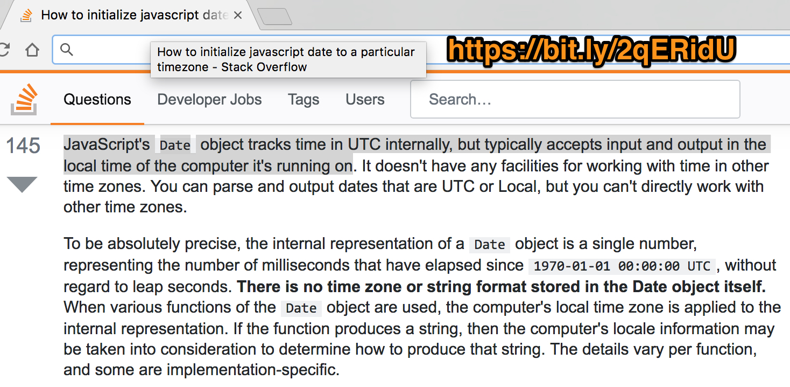

# Timezones in Node.js, or "how to quickly descend into madness"

To answer just _why_ this is such a big deal, I would direct you to [this Stack overflow reply](https://bit.ly/2qERidU):

Go ahead, click through and read the details. I'll wait.

### Why this is a big deal: a case study

Let's say your javascript runs in UTC (the default for AWS Lambda functions), while your database runs in Central.

At 2pm CDT, you create a native javascript Date object, and use it in a SQL insertion. When you check your database, you'd expect to see a time of 14:00...instead, you'll find 19:00. This is because CDT is GMT-5, or UTC/GMT time _minus 5 hours_, and javascript drops any timezone info, sending only the _local_ date and time. Your database naturally assumes you are in the same zone as it is, and saves the time _exactly as given_.

Think it can't get more confusing? It can! If your database already had a record created at 14:00 (CDT) and you fetch it in your (UTC) javascript, you'll get a native Date object at 14:00 _in your local timezone_...which is 14:00 UTC. Yikes.

To further complicate matters, you can _explicitly set a timezone for your database connection_ wholly separate from your database's actual timezone or your javascript's native timezone. This adds another layer of complexity -- which I won't even get into.

## See it in action...

To demonstrate this problem, I've written a bash script (wrapping docker, docker-compose, and other complicated stuff) for running separate js and db containers in their own timezones, as defined by environment variables:

* `DATABASE_TZ` - Timezone for the database container. Defaults to UTC
* `NODEJS_TZ` - Timezone for the javascript container. Defaults to UTC
* `SESSION_TZ` - Timezone (if any) to set on the _connection_ from javascript to database (acceptable values are an empty string, `js`, or `db`). Defaults to the database's `SYSTEM` timezone
* `ENV_TZ_OVERRIDE` - Timezone (if any) to immediately set _in the javascript code_, overriding the container's preconfigured zone

To run a single instance with default values:

> `./run.sh`

Or with specific values:

> `DATABASE_TZ="America/Chicago" NODEJS_TZ="America/Los_Angeles" ./run.sh`

And to run through _every unique combination_ of those values (as defined in the below noted python script):

> `./all.py`

## This is effectively EIGHTY ONE possible combinations...

I've already run through all of these, and included a handy dandy web page (under the `presentation` directory) in which to view the results. It is guaranteed to work locally in Firefox, and to break horribly in Chrome.

## What's the ultimate takeaway?

Our canonical database runs in Central time, and to avoid all the cross-timezone complications, _our javascript code needs to also run in Central_.

For the apps we run on our own infrastructure (think **forms** and **multilead**), this is easy to do: [configure the timezone in a `Dockerfile`](https://github.com/HigherEducation/edudirect-forms/blob/f1d0118b8dafb6f1ce543971d49c0b15603cd4b7/Dockerfile#L6-L8).

For code running outside of our infrastructure (think AWS Lambda), we have two options:

* Set a `TZ` environment variable _before the code runs_. (**This is the preferred solution**)
* Set a `TZ` environment variable in your javascript _before calling any date functions_ †

† This does not work in _all_ cases for _all_ versions of Node. Disregard this warning at your own risk!
